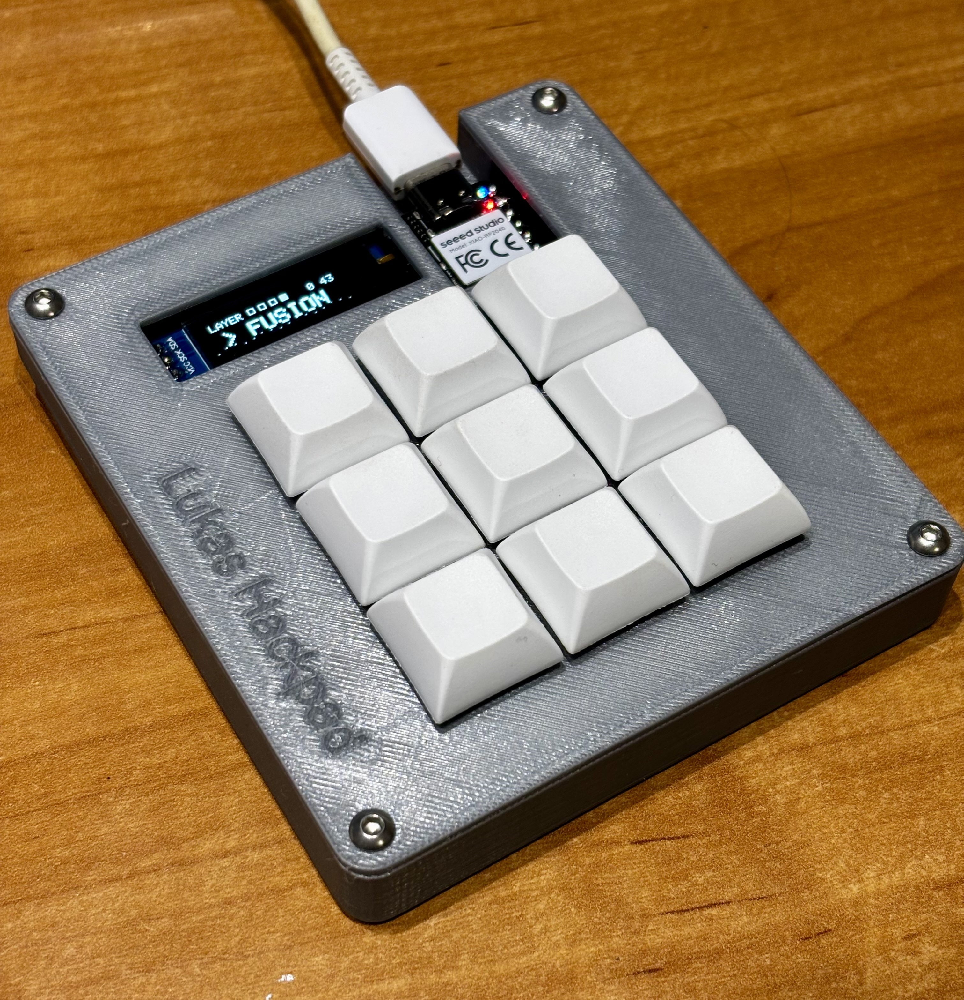
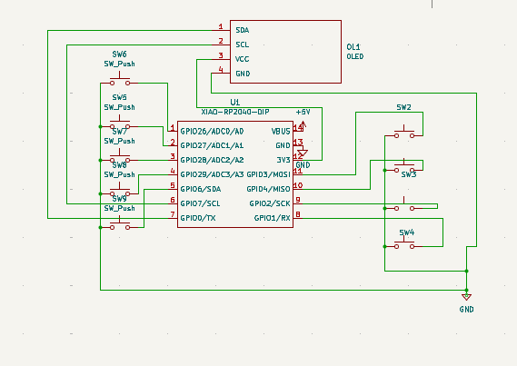
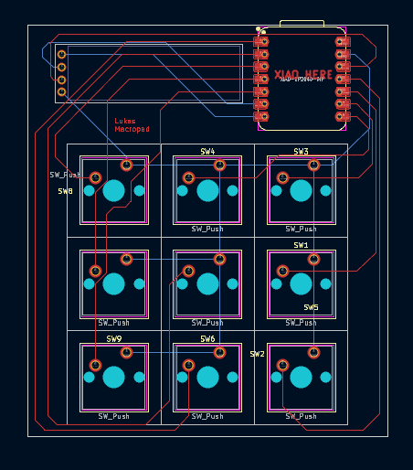
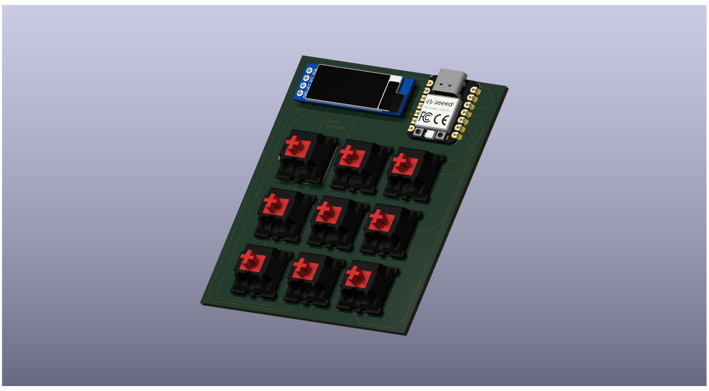
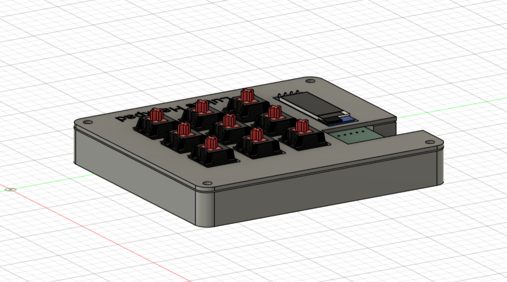

# 📟 **Lukas Hackpad Project**

This is my custom macropad featuring **9 mechanical switches**, a **0.91" OLED display**, and an **RP2040 microcontroller**.  
I will use it for **Fusion 360** and **video editing**, and the OLED display will show the current mode so I can easily see whether I’m in **Fusion 360 mode** or **Video Editing mode**.

---

# 📐 **Screenshot: Schematic**

---

# 🟩 **Screenshot: PCB**

Main PCB view:

Additional / detailed PCB view:

---

# 🧱 **Screenshot: Case and How Everything Fits**

---

# 📦 **BOM – Bill of Materials**

| Quantity | Name | Description |
|----------|------|-------------|
| 1× | RP2040 (RSA2040) | Main microcontroller |
| 9× | Red mechanical switches | MX-compatible switches |
| 9× | Keycaps | Any MX keycaps |
| 1× | OLED 0.91" 128×32 | 4-pin I2C display (GND, VCC, SCL, SDA) |
| 1× | Custom PCB | Designed in KiCad 9 |
| 1× | Case | 3D-printed or custom enclosure |

---

# 🛠 **Tools Used**
- **KiCad 9** – schematic & PCB design  
- **Fusion 360** – case design  
- **GitHub** – project management  

